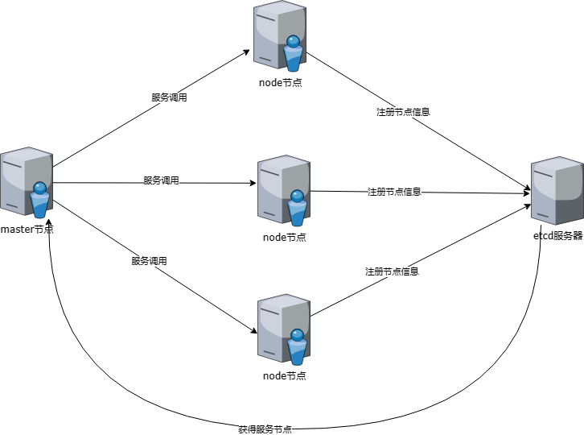

# Research

## 一、项目介绍
- ##### 分布式搜索引擎，提供集群部署和单节点使用。

- ##### 使用分片map实现倒排索引，同时将数据保存到正排索引中。再次使用时可从正排索引加载到内存中

- ##### 集群模式下提供负载均衡和流量控制

## 二、部署方法

### 1、集群模式

- #### etc/etc.yaml

  ~~~yaml
  # 单节点还是集群 node/cluster
  configType: cluster
  ~~~

- #### 集群模式下需要使用etcd作为服务发现，master结点负责调用服务，node节点提供服务

  

- #### node结点上需要填写etcd、索引、注册中心和server配置

   - ~~~yaml
      # etcd配置
      etcd:
        endpoints:
        - 192.168.92.201:2379
        - 192.168.92.201:2372
        dialTimeout: 300
      # 正排索引配置
      forwardindex:
        dbType: 1  #使用数据库类型
        dateDir: 192.168.92.201:6379 #数据库地址
      # 倒排索引配置
      reverseindex:
        indexType: 1 #使用索引结构类型，默认是跳表
        docNumEstimate: 1000 #文档数目预估
      # 服务注册中心配置
      servicehub:
        serviceHubType: proxy
        heartbeatFrequency: 3
      #限流，默认使用令牌桶算法
      limit:
        capacity: # 令牌桶容量
        rate:   # 放入令牌数量 个/s
        tokens: # 初始令牌数量
      #集群模式下node节点配置
      server :
        nodeIp : 192.168.92.201
        port : 5455
      ~~~
   - ##### 启动main.go程序 读取配置文件信息，向etcd注册服务，监听指定端口暴露服务

- #### master节点上需要填写etcd和服务注册中心配置

  - ~~~yaml
    # etcd配置
    etcd:
      endpoints:
      - 192.168.92.201:2379
      - 192.168.92.201:2372
      dialTimeout: 300
    # 服务注册中心配置
    servicehub:
      serviceHubType: proxy
      heartbeatFrequency: 3
    ~~~

  - #### 调用Research.go中的方法进行使用

      ~~~go
      c := etc.GetConfig("etc/etc.yaml")
      rs,_ := NewResearch(c)
      ~~~

### 2、单节点模式

- ### etc/etc.yaml

  ~~~yaml
  # 单节点还是集群 node/cluster
  configType: node
  ~~~

- ### 填写除server和limit外的配置信息，使用Research进行操作

  ~~~yaml
  c := etc.GetConfig("etc/etc.yaml")
  rs,_ := NewResearch(c)
  ~~~

## 三、组件扩展
### 1、负载均衡
### 2、限流策略

- #### 限流接口

  - ~~~go
      type Limiter interface {
          Allow(ctx context.Context) error // 等待请求达到通过条件
      }
    ~~~

  - ##### 实现该接口即可进行限流策略转换，Allow方法要求在一定时间内等待请求通过

- #### 客户端使用

    - ~~~go
      func NewResearch(c *etc.Config, limiter ServiceHub.Limiter) (*Research, error)
      ~~~

    - ##### 调用NewResearch传入自定义的结构体

- #### 默认配置

    - ~~~yaml
      #限流，默认使用令牌桶算法
      limit:
        capacity: # 令牌桶容量
        rate:   # 放入令牌数量 个/s
        tokens: # 初始令牌数量
      ~~~

    - ##### 令牌桶算法相关配置

- #### 只有集群模式下注册中心使用代理模式才有限流

### 3、倒排索引结构
### 4、正排索引数据库