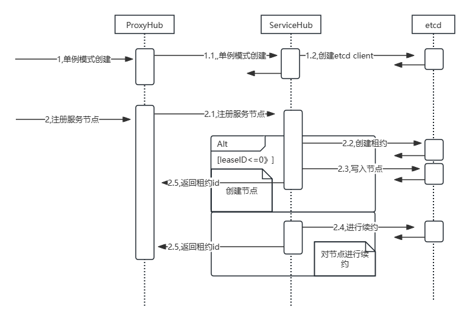
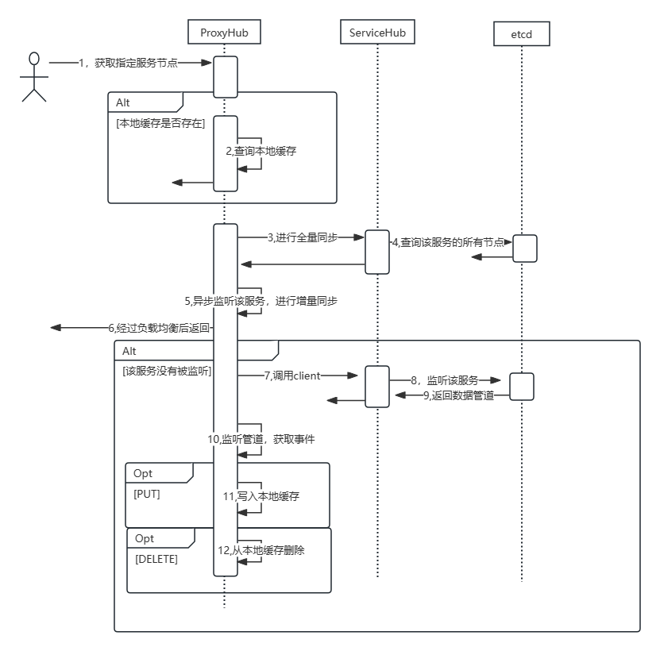

### 一、概要说明

- 本模块是提供索引服务的

- 部署采用分布式，使用etcd进行服务发现，各个服务上对索引进行垂直切分。

### 二、组件说明

#### 1、indexer

- 采用外观模式封装正排索引和倒排索引

- 正排索引采用KV数据库存储，倒排索引采用util/ResearchMap存储

- 每次使用先从正排索引加载数据到倒排索引中

#### 2、ServiceHub

- 服务注册中心组件，提供etcd客户端，以及节点的注册和注销

- 采用单例模式

- 创建和注册结点时序图

  

#### 3、ProxyHub

- 采用代理模式，继承ServiceHub

- 提供在ServiceHub的基础上提供限流和缓存

- 缓存同步通过监听etcd watch函数返回的事件管道，获取实时事件

- 时序图——获取服务节点

  

#### 4、LoadBalance

- 提供负载均衡，从多个服务节点中通过负载均衡算法选择合适的一个节点

- 采用策略模式，LoadBalance是一个接口，在创建ServiceHub时可以指定负载均衡算法