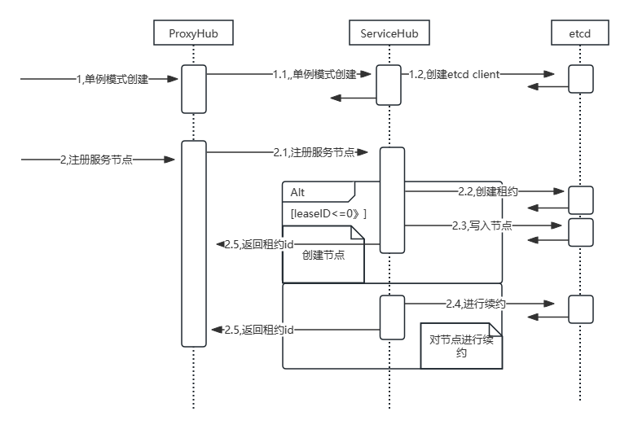
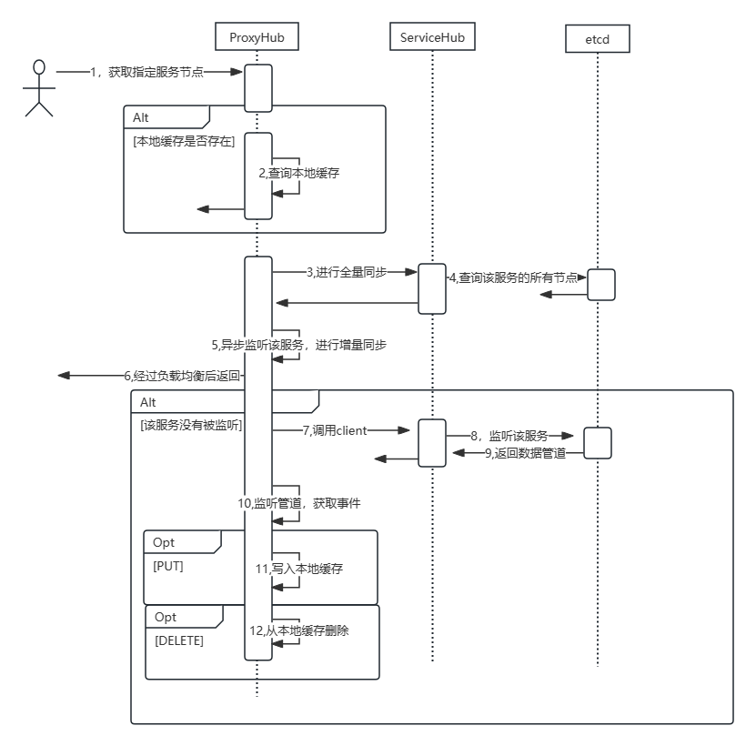

## 索引结构
## 索引服务
### 一、概要说明

- 本模块是提供索引服务的，分为集群和单节点

- 集群模式下需要服务注册中心

- 两种服务实现一个接口IIndexer，提供增删改查服务
  - ~~~go
    type IIndexer interface {
	    AddDoc(*doc.Document) (int, error)
	    DeleteDoc(docId string) int
      Search(query *term_query.TermQuery, onFlag *util.Bitmap, offFlag *util.Bitmap, orFlags []*util.Bitmap) []*doc.Document
	    Count() int
	    Close() error
    }
    ~~~

### 二、组件说明

#### 1、indexer

- 采用外观模式封装正排索引和倒排索引
- 正排索引采用KV数据库存储，倒排索引采用util/ResearchMap存储
- 每次使用先从正排索引加载数据到倒排索引中
- 单节点模式下直接使用该结构调用服务

#### 2、Sentinel

- 集群模式下master结点使用组件
- 通过注册中心获取node节点，进行grpc调用服务

#### 3、IndexServiceWorker

- 集群模式下node节点使用

## 服务注册中心

### 一、概要说明

- 本模块是提供集群模式下服务注册的

- 注册中心实现IServerHub接口

  - ~~~go
    type IServiceHub interface {
    	Regist(service string, endpoint string, leaseID etcdv3.LeaseID) (etcdv3.LeaseID, error) // 注册服务
    	UnRegist(service string, endpoint string) error                                         // 注销服务
    	GetServiceEndpoints(service string) []string                                            //服务发现
    	GetServiceEndpoint(service string) string                                               //选择服务的一台endpoint
    	Close()                                                                                 //关闭etcd client connection
    }
    ~~~

### 二、组件说明

#### 1、ServiceHub

- 服务注册中心组件，提供etcd客户端，以及节点的注册和注销

- 采用单例模式

- 创建和注册结点时序图

  

#### 2、ProxyHub

- 采用代理模式，继承ServiceHub

- 提供在ServiceHub的基础上提供限流和缓存

- 缓存同步通过监听etcd watch函数返回的事件管道，获取实时事件

- 时序图——获取服务节点

  

#### 3、LoadBalance

- 提供负载均衡，从多个服务节点中通过负载均衡算法选择合适的一个节点
- 采用策略模式，LoadBalance是一个接口，在创建ServiceHub时可以指定负载均衡算法

#### 4、Limiter

- 提供限流侧策略，实现Limiter接口即可进行策略转换

- 默认使用令牌桶算法

- Limiter接口

  ~~~go
  type Limiter interface {
  	Allow(ctx context.Context) error // 等待请求通过
  }
  ~~~

  方法要求可以等待放行